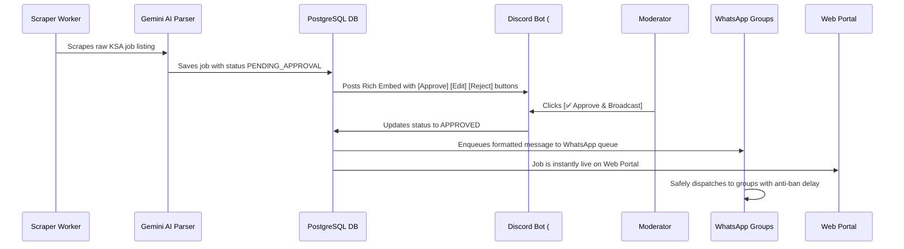

# KSA Jobs Platform (منصة وظائف السعودية)

An end-to-end automated KSA job aggregator, AI enrichment engine, Discord moderation & approval bot, WhatsApp broadcaster, and full-stack Next.js web portal tailored for the Saudi Arabian recruitment market.

---

## 🌟 Key Features

1. **Multi-Source KSA Job Scrapers**:
   - **LinkedIn KSA**: Scrapes listings across Riyadh, Jeddah, Dammam, NEOM with guest and authenticated session modes (`li_at` cookie).
   - **Bayt.com**: Scrapes Saudi Arabia job feeds.
   - **Tanqeeb KSA**: High volume Arabic job portal aggregator.
   - **Expatriates.com**: Extracts direct hire classifieds with phone and email contacts.

2. **Gemini AI Enrichment Pipeline**:
   - **Saudization Classification**: Automatically identifies `سعوديين فقط 🇸🇦`, `متاح للمقيمين 🌐`, `الأفضلية للسعوديين 🇸🇦`.
   - **City Normalization**: Maps canonical Saudi cities (الرياض, جدة, الدمام, الخبر, نيوم, مكة, المدينة, etc.).
   - **WhatsApp Post Formatter**: Formats high-conversion messages with Saudi flag badges, clean emojis, bullet points, and direct apply links.

3. **Discord Moderation & Approval Bot**:
   - Posts scraped jobs into `#jobs-pending` with interactive action buttons:
     - 🟢 `[✅ Approve & Broadcast]`
     - 🟡 `[✏️ Quick Edit]`
     - 🔴 `[❌ Reject]`
   - Posts operational summaries and metrics to `#bot-logs`.

4. **WhatsApp Broadcaster**:
   - Automatically broadcasts approved jobs to targeted WhatsApp groups and channels.
   - Built-in anti-ban rate limiting queue with randomized jitter delays (5-15s) between group sends.
   - Supports **Baileys QR direct session** and **Evolution API / WPPConnect REST instances**.

5. **Full-Stack Next.js 15 Web Portal**:
   - **Bilingual (Arabic RTL & English LTR)**.
   - Instant Search & Faceted Filter Sidebar (City, Saudization, Work Type, Category).
   - **Google Jobs Schema.org (`JobPosting`) JSON-LD** embedded on every job page for Google Search indexing.
   - Employer direct job submission portal (`/post-job`).
   - Web Admin Dashboard (`/admin`) for browser-based approvals and metrics.

---

## 📁 Monorepo Structure

```
ksajobs/
├── apps/
│   └── web/                   # Next.js 15 App Router Frontend & API routes
│       ├── src/app/           # Pages: /, /jobs/[slug], /post-job, /admin, /api/jobs
│       └── src/components/    # JobCard, HeroSearch, FilterSidebar, Navbar, Footer
│
├── services/
│   └── bot/                   # Background Service (Scrapers + AI + Discord + WhatsApp)
│       ├── src/scrapers/      # LinkedIn, Bayt, Tanqeeb, Expatriates
│       ├── src/ai/            # Gemini AI Parser & WhatsApp Formatter
│       ├── src/discord/       # Discord.js Bot & interactive approval handlers
│       ├── src/whatsapp/      # WhatsApp broadcaster with safe queue
│       ├── src/pipeline.ts    # Ingestion pipeline orchestrator
│       └── src/cli/           # CLI test runner (test-scraper.ts)
│
├── packages/
│   ├── database/              # Prisma ORM client & PostgreSQL schema
│   └── types/                 # Shared TypeScript interfaces
│
├── .env.example               # Unified configuration template
└── pnpm-workspace.yaml
```

---

## 🚀 Getting Started

### 1. Prerequisites
- Node.js >= 18 or 20+
- pnpm >= 9 or 10 (`npm install -g pnpm`)
- PostgreSQL database (or Supabase / Neon connection string)

### 2. Installation
```bash
pnpm install
```

### 3. Environment Setup
Copy `.env.example` to `.env` and fill in your keys:
```bash
cp .env.example .env
```

| Key | Description |
|---|---|
| `DATABASE_URL` | PostgreSQL connection string (Supabase/Neon/local) |
| `GEMINI_API_KEY` | Google Gemini API key from [Google AI Studio](https://aistudio.google.com) |
| `DISCORD_BOT_TOKEN` | Discord Bot Token from Discord Developer Portal |
| `DISCORD_PENDING_CHANNEL_ID` | Channel ID for `#jobs-pending` approval queue |
| `DISCORD_LOGS_CHANNEL_ID` | Channel ID for `#bot-logs` system notifications |
| `WHATSAPP_PROVIDER` | `baileys` (QR scan terminal) or `evolution` (REST server) |
| `LINKEDIN_LI_AT_COOKIE` | *(Optional)* Your `li_at` browser cookie for LinkedIn session mode |

### 4. Database Setup
```bash
pnpm db:generate
pnpm db:push
```

### 5. Running the Application

#### Start Next.js Web Portal:
```bash
pnpm dev:web
```
Open [http://localhost:3000](http://localhost:3000) to view the portal.

#### Start Scraper Worker & Discord/WhatsApp Bot:
```bash
pnpm dev:bot
```

#### Test Scrapers via CLI:
```bash
# Test LinkedIn Scraper & AI extraction
pnpm --filter @ksajobs/bot run test:linkedin

# Test Bayt Scraper
pnpm --filter @ksajobs/bot run test:bayt

# Test Tanqeeb Scraper
pnpm --filter @ksajobs/bot run test:tanqeeb

# Test Expatriates Scraper
pnpm --filter @ksajobs/bot run test:expatriates
```

---

## 🛡️ Moderation & Workflow Guide


